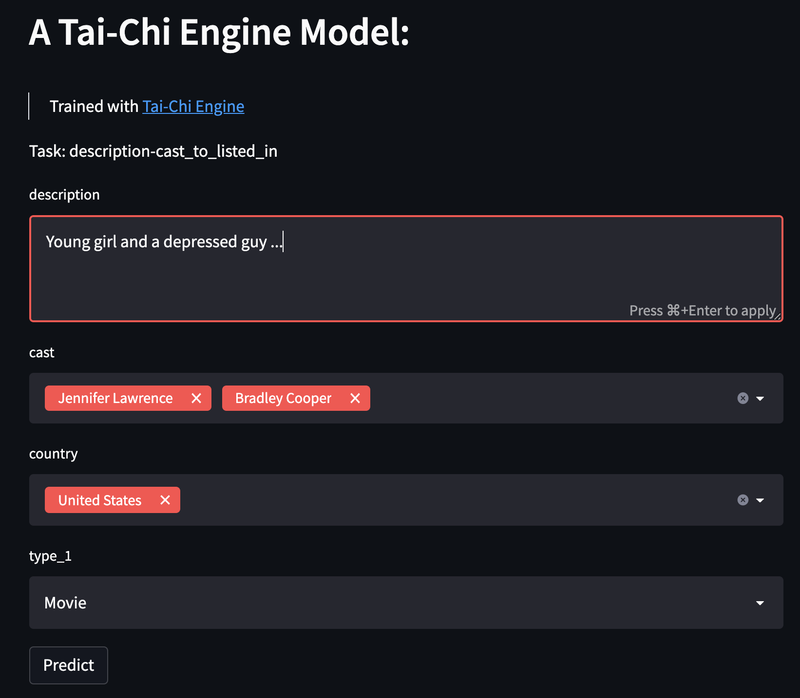

Use a Trained Model
==============================================================================

Load trained model
------------------
We can load a trained model from a project directory you've saved::

    import tai_chi_engine as tce
    PROJECT_DIR = '/path/to/project/dir'
    trained = tce.TaiChiTrained(PROJECT_DIR)

.. automodule:: tai_chi_engine.trained

    .. autoclass:: TaiChiTrained
        :members:

        .. automethod:: __init__

We can also load it for GPU inference::

    trained = tce.TaiChiTrained(PROJECT_DIR, device='cuda:0')

Inference in python
-------------------
The `TaiChiTrained` class has a `predict` method that can be used to make prediction on python dictionary::

    x = {'img': image}
    pred = trained.predict(x)

Notice, the key 'img' is the pandas column name, if you trained the model to use "user_id","movie_id" as the X columns, the input data looks like::

    x = {'user_id': 128, 'movie_id': 42}
    pred = trained.predict(x)

Other elements in `TaiChiTrained`
---------------------------------
* `TaiChiTrained.final_model`: the trained model
* `TaiChiTrained.x_columns`: the X columns used to train the model
* `TaiChiTrained.y_columns`: the Y columns used to train the model
* `TaiChiTrained.phase`: The configuration object
* `TaiChiTrained.device`: The inference device
* `TaiChiTrained.qdict`: A dictionary of Quantify

Streamlit Deployment
--------------------
Start a streamlit app to demonstrate your prototype::

    from tai_chi_engine.app import StartStreamLit
    # You'll have to pick a trained project folder, and assign a port
    tc_app = StartStreamLit("./project_directory", port = 8501)
    tc_app.start()

Then you can see some thing like following on your browser::

    http://localhost:8501/

Stop the streamlit app by doing ::

    tc_app.stop()

Or `pkill -f streamlit`