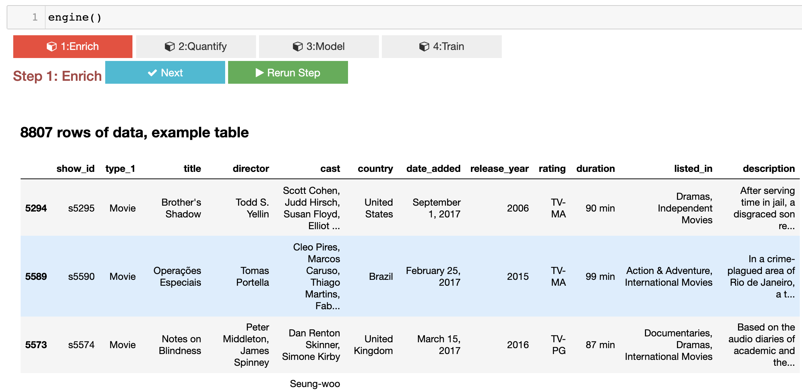

Tutorial
==============================================================================

You can visit the `youtube video <https://www.youtube.com/watch?v=uIeX0VvLKd4>`_  for a walk through tutorial.

Start with Dataframe
----------------------

Everything start with a dataframe, also known as `table` in python.

You can read it from a csv file::

        import pandas as pd
        df = pd.read_csv('data.csv')

Or you can read from some sql database::

        from sqlalchemy import create_engine
        with create_engine('your_db_connection_uri').connect() as conn:
            df = pd.read_sql('select * from table', conn)

Or you can read from some image directory::

        from tai_chi_engine.utils import df_creator_image_folder
        df = df_creator_image_folder('./img/directory')

It doesn't matter how, now you have a dataframe

Then you can start with::

        from tai_chi_engine import TaiChiEngine
        engine = TaiChiEngine(df, project="./example_project")
        engine()

In jupyter notebook, you will see something like this

Enrichment
------------------
以腰為軸 上下相隨

Enrichment **add more columns** to your dataframe. It defines how you want to enrich a column, Tai-Chi Engine will take care how the rule will apply to each row

Quantify
------------------
內外相合 用意不用力

This step defines which columns will be used for X or Y, and how they are going to be transform to tensors. (Because model love tensors). These modules define such process, but no calculation happens during all the defining.

Modeling
------------------
靜如山岳 動若江河

The model is assembled in a pincer design, you've already set your Xs, and you've set your Y. We try to figure out how to design the model for the task.
* Xs quantify =decide=> Entry Model Map
* Exit Model <=decide= Y quantify
* YourAwesomeModel = Assemble(Entry Model Map, Exit Model)

Training
------------------
Train your AI mode.

The engine will use `pytorch-lightning <https://pytorch-lightning.readthedocs.io/en/latest/>`_ to train your model.

Then you can use your this model in the way we described in the `Use a Trained Model <trained>` section.